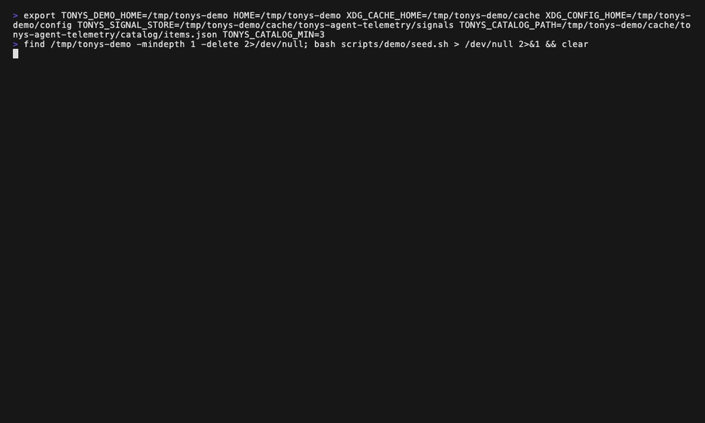

# tonys-agent-telemetry

> Observe, govern, and learn from your local AI agents — in the terminal.

-blue>)


local-first TUI that watches AI-agent
activity across providers (Claude Code, OTLP-emitting frameworks, vLLM,
Ollama), reconstructs the orchestration as a DAG, extracts behavioural
signals, and recommends best-practice skills — with citations to the
exact signal that triggered each recommendation.

Single static Go binary. No daemon, no database, no SaaS, no signup.

<p align="center">
  
</p>

## Quickstart

```sh
# 1. Install (any of these)
brew install vanillacake369/tap/tonys-agent-telemetry
# or: nix run github:vanillacake369/tonys-agent-telemetry
# or: go install github.com/vanillacake369/tonys-agent-telemetry@latest

# 2. Launch
tonys-agent-telemetry

# 3. The Sessions tab auto-populates from ~/.claude/projects/.
#    Press 1-6 (or Tab/Shift+Tab) to cycle tabs.
#    Press ^G to open the Control tab.
#    Press ? at any time for the which-key overlay.
```

If `~/.claude/projects/` is empty, all tabs render empty-state guides.
Run any Claude Code session, then re-launch.

## Features

- **Sessions** — Browse and resume past Claude Code sessions; fork to explore a branch.
- **Skills** — Search local + GitHub skills; a best-practice catalog (181 entries, CC-BY-SA-4.0) plus an Advisor pane that recommends skills based on your real session activity, with dual citations on every recommendation.
- **Cost** — Per-provider and per-model spending dashboard.
- **Hooks** — Visualise `~/.claude/settings.json` hook events and scripts as a workflow diagram.
- **DAG** — Live multi-provider agent orchestration graph with provider badges, status colours, in-graph `/`-search, `n`/`N` cycle, and `g` for compact overview.
- **Trends** — Longitudinal sparklines (`▁▂▃▄▅▆▇█`) per signal type with Start / Last / Δ vs avg + per-provider fidelity tier legend.
- **Control** — Read-only governance view: policy, budget burn-down, denial log.

### Auto-detected providers

Each provider activates only when detected.

| Provider        | Detection                              | Fidelity                                             |
| --------------- | -------------------------------------- | ---------------------------------------------------- |
| **Claude Code** | `~/.claude/projects/` exists           | Full (timestamps, tokens, parent-child)              |
| **OTLP/HTTP**   | port `4318` bindable on localhost      | Full when caller emits `gen_ai.*` + `parent_span_id` |
| **vLLM**        | `:8000/metrics` exposes `vllm:` series | Aggregate only (no per-call parent linkage)          |
| **Ollama**      | `:11434/api/tags` responds             | Presence only (model-load timeline, no token counts) |

Anything that emits OTLP/JSON to the receiver counts — LangGraph,
CrewAI, AutoGen, OpenAI Agents SDK, LiteLLM, TGI, OpenRouter, Letta,
smolagents. No plugin loading; the OTLP endpoint IS the integration
interface.

## Installation

### Homebrew (macOS + Linux)

```sh
brew install vanillacake369/tap/tonys-agent-telemetry
```

### Nix

```sh
nix run github:vanillacake369/tonys-agent-telemetry
```

Or pin to your flake:

```nix
inputs.tonys-agent-telemetry.url = "github:vanillacake369/tonys-agent-telemetry";
```

### Linux packages (.deb / .rpm / .apk)

Download the matching package from the [latest release][rel], then:

```sh
sudo apt install ./tonys-agent-telemetry_*.deb     # Debian / Ubuntu
sudo dnf install ./tonys-agent-telemetry_*.rpm     # Fedora / RHEL
sudo apk add --allow-untrusted ./tonys-agent-telemetry_*.apk
```

### Pre-built tarball

```sh
gh release download v0.1.0 -p '*linux_amd64.tar.gz' --repo vanillacake369/tonys-agent-telemetry
tar -xzf tonys-agent-telemetry_*.tar.gz tonys-agent-telemetry
sudo mv tonys-agent-telemetry /usr/local/bin/
```

### From source (`go install`)

Requires Go 1.26+. The pre-built binaries do not — they ship as
`CGO_ENABLED=0` static binaries.

```sh
go install github.com/vanillacake369/tonys-agent-telemetry@latest
```

[rel]: https://github.com/vanillacake369/tonys-agent-telemetry/releases/latest

## Verifying release artefacts

Every tagged release ships with cosign keyless signatures and SLSA L3
provenance. Verify in one block:

```sh
ARTIFACT=tonys-agent-telemetry_linux_amd64.tar.gz

cosign verify-blob \
  --certificate "${ARTIFACT}.pem" \
  --signature   "${ARTIFACT}.sig" \
  --certificate-identity-regexp \
    '^https://github\.com/vanillacake369/tonys-agent-telemetry/\.github/workflows/release\.yml@refs/tags/' \
  --certificate-oidc-issuer https://token.actions.githubusercontent.com \
  "${ARTIFACT}"

slsa-verifier verify-artifact \
  --provenance-path tonys-agent-telemetry.intoto.jsonl \
  --source-uri github.com/vanillacake369/tonys-agent-telemetry \
  "${ARTIFACT}"
```

Full threat model, supported versions, and reporting process live in
[`SECURITY.md`](./SECURITY.md).

## CLI flags

```sh
tonys-agent-telemetry --otlp-export <url>      # forward spans to a remote OTLP/JSON receiver
tonys-agent-telemetry --snapshot-record <file> # append every span to JSONL for replay
tonys-agent-telemetry --replay <file>          # replay JSONL instead of starting providers
tonys-agent-telemetry --emit-signals --replay <file> | jq   # extract signals as JSON, exit
```

`TAT_OTLP_EXPORT` and `TAT_SNAPSHOT_RECORD` env vars are equivalent to
the matching flags.

Full flag + env var reference (including `TONYS_OTLP_BIND`,
`TONYS_MAX_SPANS`, `TONYS_SIGNAL_STORE`, `TONYS_CATALOG_PATH`,
`TONYS_CATALOG_MIN`, `NO_COLOR`, `TAT_DEBUG`) and every TUI key binding
in [`docs/cli-reference.md`](./docs/cli-reference.md).

## Where to go next

- **First-time UX** — [`docs/faq.md`](./docs/faq.md) — "what is this, what is it not".
- **Stuck?** — [`docs/troubleshooting.md`](./docs/troubleshooting.md) — first-launch empty state, OTLP port conflicts, Docker bridge, offline catalog, cosign verification failures.
- **Contributing** — [`CONTRIBUTING.md`](./CONTRIBUTING.md) — dev setup, commit conventions, AI-assistance disclosure.
- **Internals** — [`docs/architecture.md`](./docs/architecture.md) — package map, data flow, contracts that matter, fidelity tier model.
- **Changelog** — [`CHANGELOG.md`](./CHANGELOG.md) — what shipped in each release.
- **Security** — [`SECURITY.md`](./SECURITY.md) — vulnerability reporting + artefact verification.

## Acknowledgements

Built on the excellent [bubbletea][bt] / [lipgloss][lg] / [bubbles][bb]
stack by [Charm](https://charm.sh). Catalog data from
[FlorianBruniaux/claude-code-ultimate-guide][cug] (CC-BY-SA-4.0).
Release pipeline uses [goreleaser][grl], [cosign][cs], and the
[SLSA framework][slsa].

[bt]: https://github.com/charmbracelet/bubbletea
[lg]: https://github.com/charmbracelet/lipgloss
[bb]: https://github.com/charmbracelet/bubbles
[cug]: https://github.com/FlorianBruniaux/claude-code-ultimate-guide
[grl]: https://goreleaser.com
[cs]: https://github.com/sigstore/cosign
[slsa]: https://slsa.dev

## License

MIT — see [LICENSE](./LICENSE).
